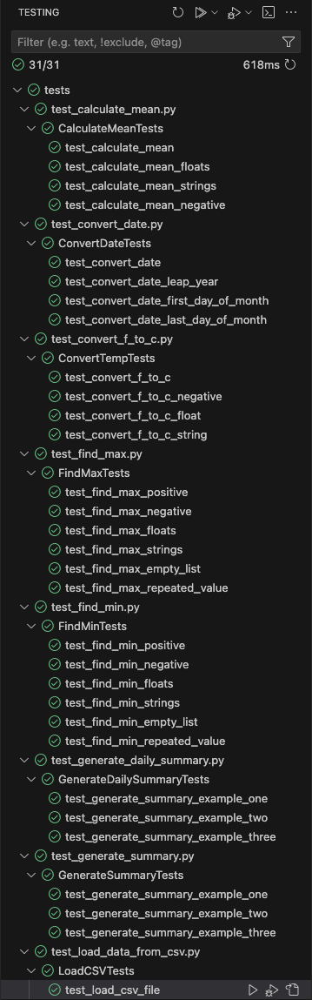

# Plus Resources: Weather Project Template

Starter code for the Plus Weather project.

## TODO

- [X] Implement the methods in `weather.py`.
- [X] Verify that everything works as intended by running the tests with `python run_tests.py`.

